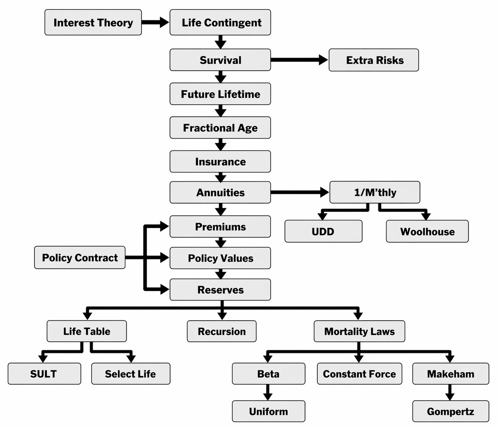

# USER GUIDE

__actuarialmath -- Life Contingent Risks with Python__

This Python package implements fundamental methods for modeling life contingent risks, and closely follows the coverage of traditional topics in actuarial exams and standard texts such as the "Fundamentals of Actuarial Math - Long-term" exam syllabus by the Society of Actuaries, and "Actuarial Mathematics for Life Contingent Risks" by Dickson, Hardy and Waters.  The actuarial concepts, and corresponding Python classes, are introduced and modeled hierarchically.





## Quick Start

1. `pip install actuarialmath`

   - also requires `numpy`, `scipy`, `matplotlib` and `pandas`.


2. Start Python (version >= 3.10) or Jupyter-notebook


   - Select and import a suitable subclass to initialize with your actuarial assumptions, such as `MortalityLaws` (or a special law like `ConstantForce`), `LifeTable`, `SULT`, `SelectLife` or `Recursion`.

   - Call appropriate methods to compute intermediate or final results, or to `solve` parameter values implicitly.

   - Adjust the answers with `ExtraRisk` or `Mthly` (or its `UDD` or `Woolhouse`) classes


The code chunks in the [Colab](https://colab.research.google.com/drive/1TcNr1x5HbT2fF3iFMYGXdN_cvRKiSua4?usp=sharing), or [Jupyter notebook](https://terence-lim.github.io/notes/faml.ipynb), demonstrate how to solve each of the sample FAM-L exam questions released by the SOA. Examples, a user guide, API references and other resources are made available below. 

## Examples

__SOA FAM-L sample question 5.7__: 

Given $A_{35} = 0.188$, $A_{65} = 0.498$, $S_{35}(30) = 0.883$, calculate the EPV of a temporary annuity $\ddot{a}^{(2)}_{35:\overline{30|}}$ paid half-yearly using the Woolhouse approximation.

```
from actuarialmath import Recursion, Woolhouse
# initialize Recursion class with actuarial inputs
life = Recursion().set_interest(i=0.04)\
                  .set_A(0.188, x=35)\
                  .set_A(0.498, x=65)\
                  .set_p(0.883, x=35, t=30)
# modfy the standard results with Woolhouse mthly approximation
mthly = Woolhouse(m=2, life=life, three_term=False)
# compute the desired temporary annuity value
print(1000 * mthly.temporary_annuity(35, t=30)) #   solution = 17376.7
```

__SOA FAM-L sample question 7.20__:

For a fully discrete whole life insurance of 1000 on (35), you are given
- First year expenses are 30% of the gross premium plus 300
- Renewal expenses are 4% of the gross premium plus 30
- All expenses are incurred at the beginning of the policy year
- Gross premiums are calculated using the equivalence principle
- The gross premium policy value at the end of the first policy year is R
- Using the Full Preliminary Term Method, the modified reserve at the end of the first policy year is S
- Mortality follows the Standard Ultimate Life Table
- _i_ = 0.05

Calculate R − S
```
from actuarialmath import SULT, Contract
life = SULT()
# compute the required FPT policy value
S = life.FPT_policy_value(35, t=1, b=1000)  # is always 0 in year 1!
# input the given policy contract terms
contract = Contract(benefit=1000,
                    initial_premium=.3,
                    initial_policy=300,
                    renewal_premium=.04,
                    renewal_policy=30)
# compute gross premium using the equivalence principle
G = life.gross_premium(A=life.whole_life_insurance(35), **contract.premium_terms)
# compute the required policy value
R = life.gross_policy_value(35, t=1, contract=contract.set_contract(premium=G))
print(R-S)   # solution = -277.19
```


## Resources

1. [Colab](https://colab.research.google.com/drive/1TcNr1x5HbT2fF3iFMYGXdN_cvRKiSua4?usp=sharing) or [Jupyter notebook](https://terence-lim.github.io/notes/faml.ipynb), to solve all sample SOA FAM-L exam questions

2. [Online User Guide](https://terence-lim.github.io/actuarialmath-guide/), or [download pdf](https://terence-lim.github.io/notes/actuarialmath-guide.pdf)

3. [API reference](https://actuarialmath.readthedocs.io/en/latest/)

4. [Github repo](https://github.com/terence-lim/actuarialmath.git) and [issues](https://github.com/terence-lim/actuarialmath/issues)


## Sources

- SOA FAM-L Sample Questions: [copy retrieved Aug 2022](https://terence-lim.github.io/notes/2022-10-exam-fam-l-quest.pdf)

- SOA FAM-L Sample Solutions: [copy retrieved Aug 2022](https://terence-lim.github.io/notes/2022-10-exam-fam-l-sol.pdf)

- Actuarial Mathematics for Life Contingent Risks, by David Dickson, Mary Hardy and Howard Waters, published by Cambridge University Press.


## Contact

Github: [https://terence-lim.github.io](https://terence-lim.github.io)
